# QA FlowChart — AVaOut: Avatar Out
> UE 5.6.1 · Listen Server · Steam OSS  
> 재정리일: 2026-04-29  
> 각 플로우차트는 Mermaid 문법으로 작성되었습니다.

---

# 싱글플레이 테스트 케이스 (S-001 ~ S-043)

---

## S1. 캐릭터 이동 & 파쿠르

---

## S-001 · 파쿠르 연속 입력 — 벽 오르기/점프/스프린트

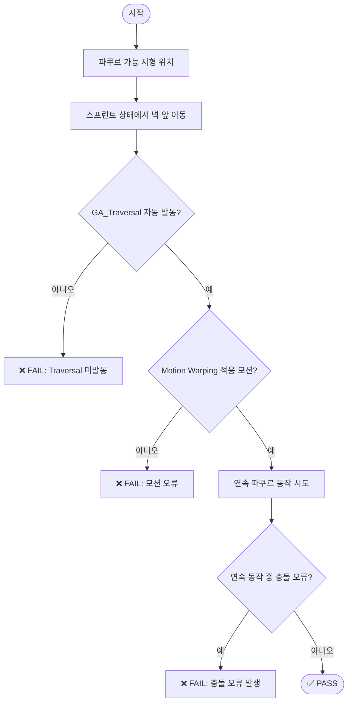

---

## S-002 · 웅크리기(Crouch) 입력 → 자세 전환 + 캡슐 콜리전 조정

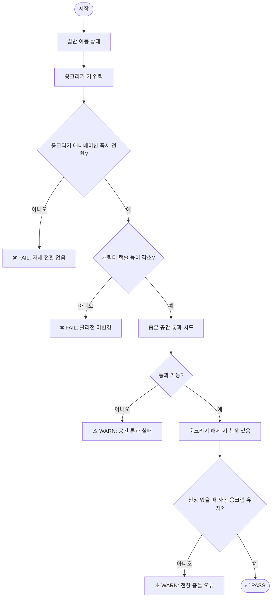

---

## S-003 · 점프 입력 → 공중 애니메이션 + 착지 애니메이션 + 착지 사운드

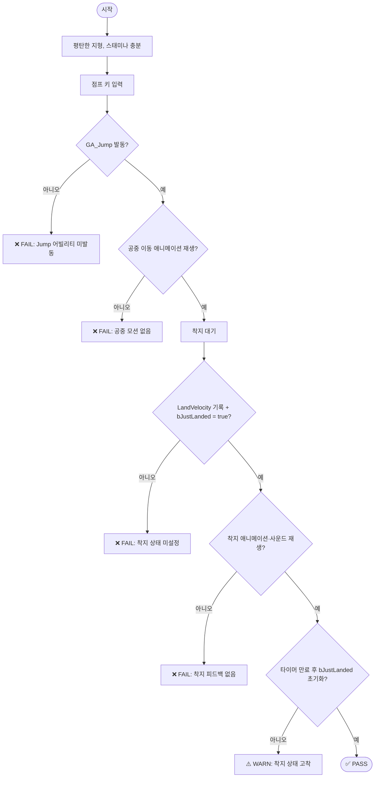

---

## S-004 · 스프린트 입력 → 속도 즉시 증가 + 스태미나 2f/초 감소 + 소진 후 회복

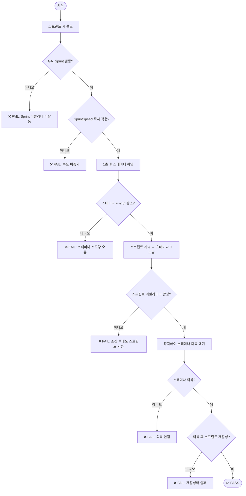

---

## S-005 · 발소리 표면 타입별 Foley 사운드 재생 (AO_FoleyAudioBank)

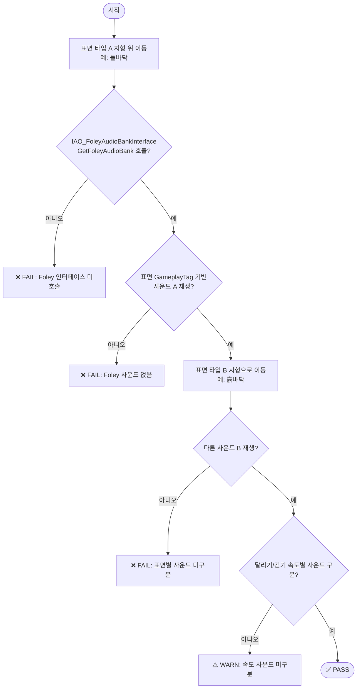

---

## S2. 전투 & 어빌리티 피드백

---

## S-006 · 공격 입력 → GAS 어빌리티 발동 + 몽타주 + GameplayCue VFX/SFX + 피해 수치

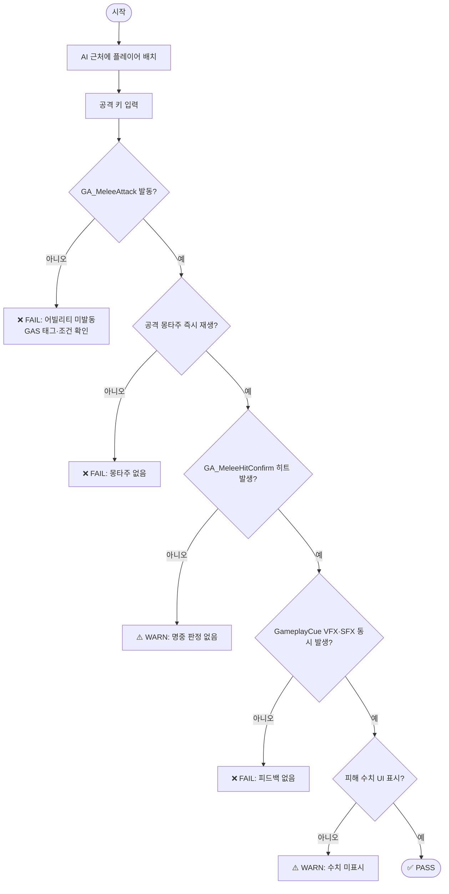

---

## S-007 · 피격 시 → HitReact 방향별 몽타주 + 무적 프레임 + 화면 비네트

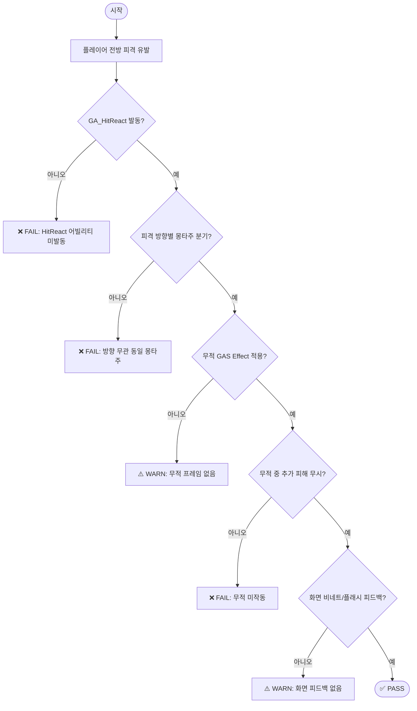

---

## S-008 · 사망 → Death 어빌리티 몽타주 + 래그돌 전환 + 사망 태그 적용

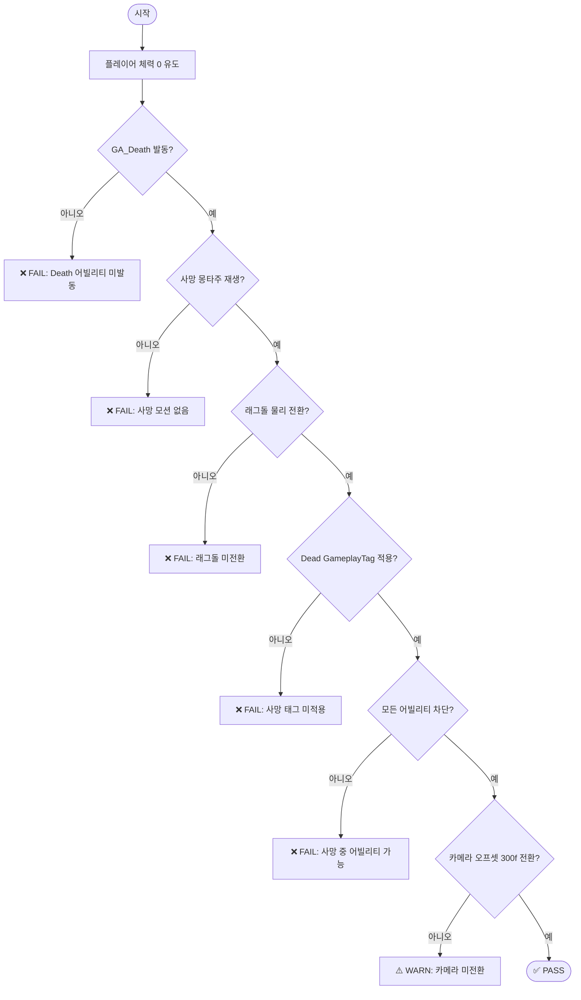

---

## S-009 · 아웃라인 어빌리티 → 대상 외곽선 표시 + 시간 만료 제거

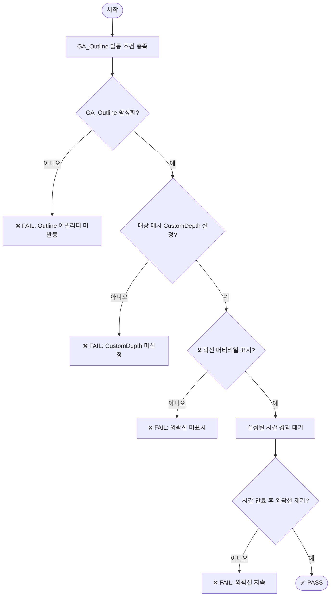

---

## S-010 · 빠른 연속 입력 (공격+점프+인터랙션 동시) → 어빌리티 충돌 크래시 없음

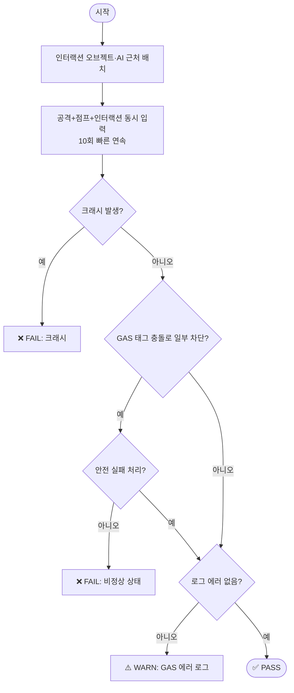

---

## S3. 스태미나 & GAS AttributeSet

---

## S-011 · 스태미나 25% 잠금(Lockout) — 스프린트 차단 및 복구

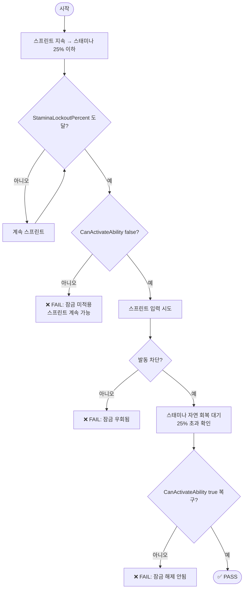

---

## S-012 · 패시브 아이템 효과 적용 (MaxHp/Stamina/MovementSpeed) + 전역 리셋

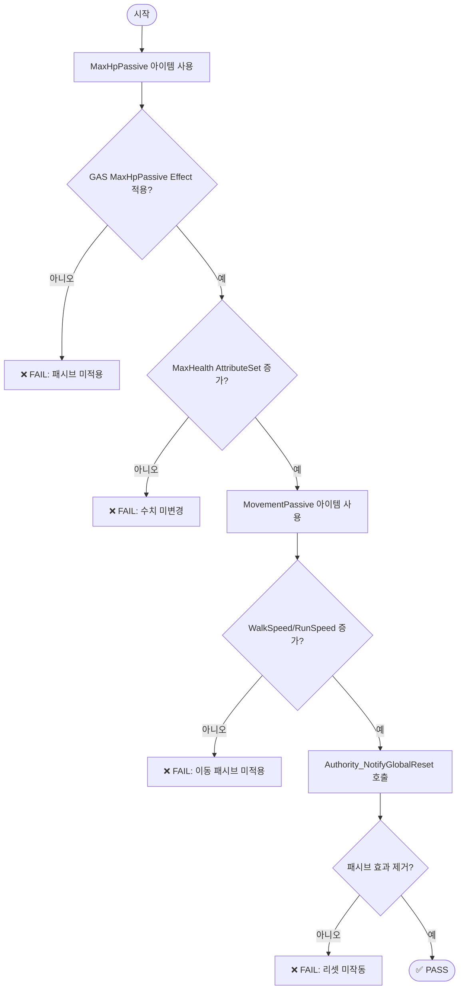

---

## S4. 인벤토리 & 아이템

---

## S-013 · 인벤토리 아이템 습득/사용/드롭 전 사이클

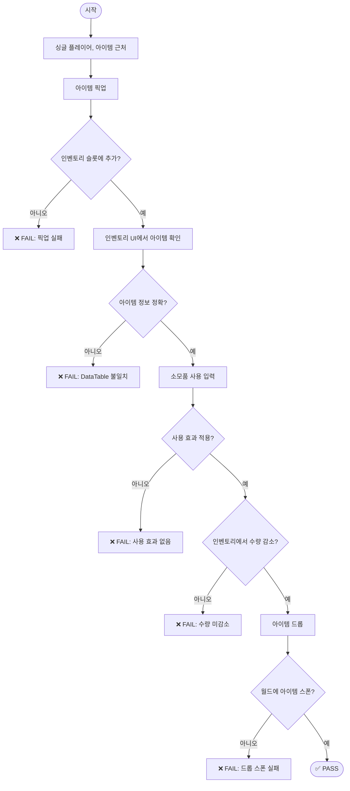

---

## S-014 · 아이템 픽업 → 픽업 사운드(Multicast_PlayInventorySound) + 슬롯 즉시 갱신

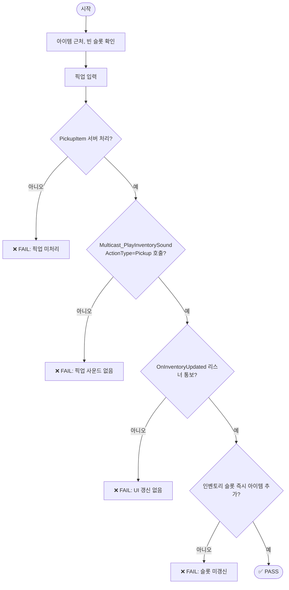

---

## S-015 · 아이템 사용 → 사용 사운드 + 수량 즉시 감소 + 효과 VFX

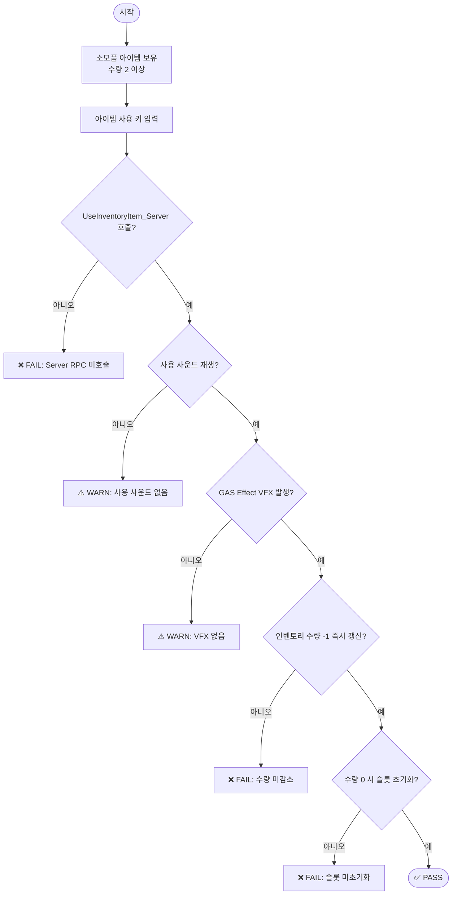

---

## S-016 · 아이템 드롭 → 드롭 사운드 + 발 앞 월드 스폰

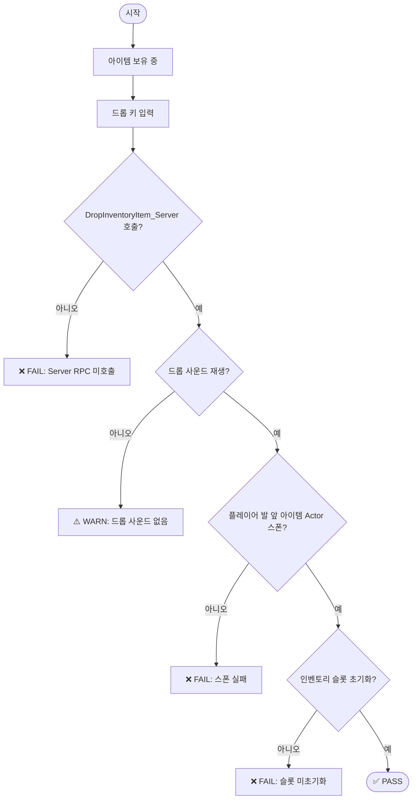

---

## S-017 · 세이프존(AO_InventorySaveZone) 진입/이탈 시 인벤토리 보존

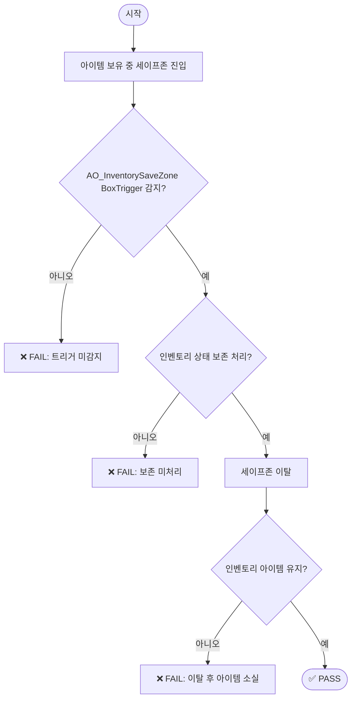

---

## S-018 · ItemDataTable CSV 로드 실패 시 크래시 없음

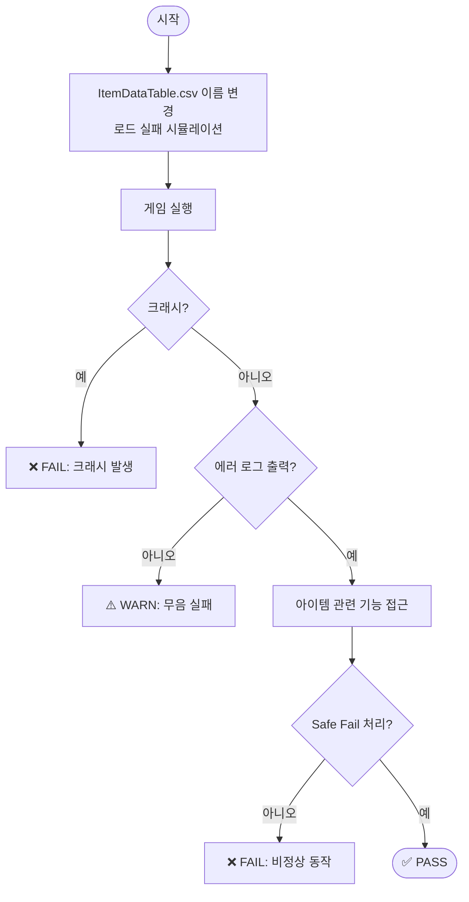

---

## S5. AI 시스템

---

## S-019 · AI StateTree — 플레이어 인지(Sight) 및 Roam→Chase 전환

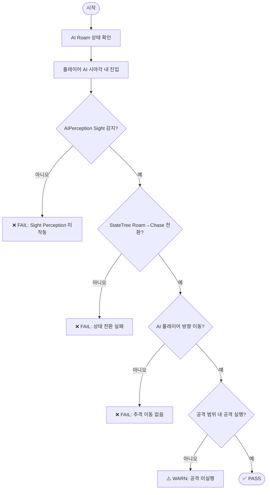

---

## S-020 · Insect AI 납치 — DoT 피해(10f/초) + 이동 제한 + 해제 후 복구

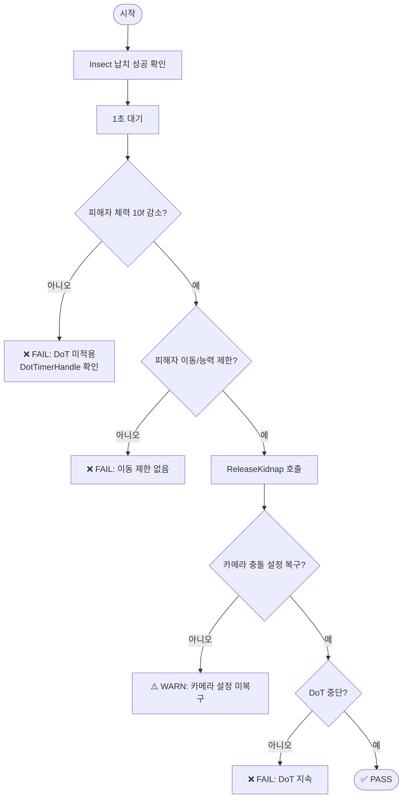

---

## S-021 · Bull 공격 후 쿨다운(3.5초) — 재공격 차단

```mermaid
flowchart TD
    A([시작]) --> B[Bull 공격 완료]
    B --> C{bInPostAttackCooldown = true?}
    C -- 아니오 --> D[❌ FAIL: 쿨다운 상태 미설정]
    C -- 예 --> E[3.5초 내 재공격 시도 관찰]
    E --> F{공격 발생?}
    F -- 예 --> G[❌ FAIL: 쿨다운 중 재공격]
    F -- 아니오 --> H[PostAttackTimerHandle 만료 대기]
    H --> I{bInPostAttackCooldown = false?}
    I -- 아니오 --> J[❌ FAIL: 쿨다운 미해제]
    I -- 예 --> K{재공격 가능?}
    K -- 아니오 --> L[❌ FAIL: 쿨다운 후 공격 불가]
    K -- 예 --> M([✅ PASS])
```

---

## S-022 · AI 소리 인식 — 마지막 청취 위치 기억 (HeardMemoryDuration 10초)

```mermaid
flowchart TD
    A([시작]) --> B[플레이어 소리 유발\n발소리/공격음]
    B --> C{AIPerceptionComponent OnNoiseHeard 감지?}
    C -- 아니오 --> D[❌ FAIL: 소리 인식 실패\nHearingRange 2000f 확인]
    C -- 예 --> E{SetLastHeardLocation 갱신?}
    E -- 아니오 --> F[❌ FAIL: 메모리 미저장]
    E -- 예 --> G[AI 마지막 소리 위치로 이동 확인]
    G --> H{이동 정상?}
    H -- 아니오 --> I[❌ FAIL: 위치 탐색 실패]
    H -- 예 --> J[10초 경과 대기]
    J --> K{HeardMemoryDuration 만료?}
    K -- 아니오 --> L[⚠️ WARN: 메모리 미만료]
    K -- 예 --> M([✅ PASS])
```

---

## S-023 · AI NavMesh 미도달 플레이어 필터링 (bFilterUnreachablePlayers)

```mermaid
flowchart TD
    A([시작]) --> B[플레이어 NavMesh 밖으로 이동\n지붕/높은 곳]
    B --> C{IsPlayerOnNavMesh false?}
    C -- 아니오 --> D[NavMesh 판정 재확인]
    C -- 예 --> E{CanReachPlayer false?}
    E -- 아니오 --> F[❌ FAIL: 도달 불가 판정 오류]
    E -- 예 --> G{bFilterUnreachablePlayers = true?}
    G -- 아니오 --> H[⚠️ WARN: 필터 비활성화]
    G -- 예 --> I{AI 추격 중단?}
    I -- 아니오 --> J[❌ FAIL: 미도달 플레이어 추격]
    I -- 예 --> K([✅ PASS])
```

---

## S-024 · Insect 납치 해제 시 투척(bThrow=true) 물리 적용

```mermaid
flowchart TD
    A([시작]) --> B[Insect 납치 성공 확인]
    B --> C[ReleaseKidnap bThrow=true 호출]
    C --> D{피해자에 물리 임펄스 적용?}
    D -- 아니오 --> E[❌ FAIL: 임펄스 미적용]
    D -- 예 --> F{투척 방향 Insect 전방?}
    F -- 아니오 --> G[⚠️ WARN: 투척 방향 오류]
    F -- 예 --> H[착지 대기]
    H --> I{낙하 물리 정상 동작?}
    I -- 아니오 --> J[❌ FAIL: 낙하 물리 오류]
    I -- 예 --> K{착지 후 이동 제한 해제?}
    K -- 아니오 --> L[❌ FAIL: 이동 제한 미해제]
    K -- 예 --> M([✅ PASS])
```

---

## S6. 퍼즐 시스템

---

## S-025 · 퍼즐 인터랙션 타입 검증 — Toggle / OneTime / HoldActive

```mermaid
flowchart TD
    A([시작]) --> B[Toggle 퍼즐 테스트]
    B --> C[인터랙션 1회 → 활성화]
    C --> D{활성?}
    D -- 아니오 --> E[❌ FAIL: Toggle 비활성]
    D -- 예 --> F[인터랙션 2회 → 비활성화]
    F --> G{비활성?}
    G -- 아니오 --> H[❌ FAIL: Toggle 재비활성 실패]
    G -- 예 --> I[OneTime 퍼즐 테스트]
    I --> J[1회 인터랙션]
    J --> K{활성화?}
    K -- 아니오 --> L[❌ FAIL]
    K -- 예 --> M[재인터랙션 시도]
    M --> N{재활성화 안됨?}
    N -- 예 --> O[❌ FAIL: OneTime 재작동]
    N -- 아니오 --> P[HoldActive 퍼즐 테스트]
    P --> Q[누르는 동안 활성 유지]
    Q --> R{손 뗄 시 비활성?}
    R -- 아니오 --> S[❌ FAIL]
    R -- 예 --> T([✅ PASS])
```

---

## S-026 · 퍼즐 HoldActive 모드 — 진행도(0.0~1.0) 선형 보간

```mermaid
flowchart TD
    A([시작]) --> B[HoldActive 퍼즐 앞 위치]
    B --> C[홀드 인터랙션 시작]
    C --> D{TargetProgress 0→1 증가?}
    D -- 아니오 --> E[❌ FAIL: 진행도 미증가]
    D -- 예 --> F{TransformTimerHandle 보간?}
    F -- 아니오 --> G[❌ FAIL: 보간 없음\n즉시 이동]
    F -- 예 --> H[홀드 해제]
    H --> I{TargetProgress 감소?}
    I -- 아니오 --> J[⚠️ WARN: 진행도 고정]
    I -- 예 --> K[진행도 1.0 도달 테스트]
    K --> L{퍼즐 완료?}
    L -- 아니오 --> M[❌ FAIL: 1.0 도달 시 미완료]
    L -- 예 --> N([✅ PASS])
```

---

## S-027 · 퍼즐 블로킹 태그 감지 → 즉시 실패 처리

```mermaid
flowchart TD
    A([시작]) --> B[블로킹 태그 설정 퍼즐 확인]
    B --> C[블로킹 조건 유발]
    C --> D{CheckAllConditions 블로킹 태그 감지?}
    D -- 아니오 --> E[❌ FAIL: 블로킹 태그 무시]
    D -- 예 --> F{FailPuzzle 즉시 호출?}
    F -- 아니오 --> G[❌ FAIL: 즉시 실패 미처리]
    F -- 예 --> H{OnPuzzleFailed 델리게이트 발생?}
    H -- 아니오 --> I[❌ FAIL: 델리게이트 미발생]
    H -- 예 --> J([✅ PASS])
```

---

## S-028 · 퍼즐 시간 제한(TimeLimit) 초과 → 자동 실패

```mermaid
flowchart TD
    A([시작]) --> B[TimeLimit 설정 퍼즐 이벤트 발생]
    B --> C{ConditionTimerHandles 타이머 시작?}
    C -- 아니오 --> D[❌ FAIL: 타이머 미시작]
    C -- 예 --> E[TimeLimit 시간 경과 대기]
    E --> F{OnConditionTimeout 호출?}
    F -- 아니오 --> G[❌ FAIL: 타임아웃 미호출]
    F -- 예 --> H{퍼즐 실패 처리?}
    H -- 아니오 --> I[❌ FAIL: 실패 미처리]
    H -- 예 --> J{퍼즐 리셋 또는 비활성화?}
    J -- 아니오 --> K[⚠️ WARN: 리셋 없음]
    J -- 예 --> L([✅ PASS])
```

---

## S-029 · 퍼즐 순서 조건(bRequiresOrder) — 잘못된 순서 실패 + 올바른 순서 성공

```mermaid
flowchart TD
    A([시작]) --> B[bRequiresOrder = true 퍼즐 확인\n정답 순서: A→B→C]
    B --> C[잘못된 순서 B→A→C 입력]
    C --> D{ConditionOrderHistory 불일치?}
    D -- 아니오 --> E[❌ FAIL: 순서 검증 안됨]
    D -- 예 --> F{FailPuzzle 호출?}
    F -- 아니오 --> G[❌ FAIL: 실패 미처리]
    F -- 예 --> H[올바른 순서 A→B→C 재입력]
    H --> I{퍼즐 완료?}
    I -- 아니오 --> J[❌ FAIL: 올바른 순서도 실패]
    I -- 예 --> K([✅ PASS])
```

---

## S7. HUD & UI 피드백

---

## S-030 · 체력 피해 → AO_HealthWidget 실시간 감소 + 색상 변화

```mermaid
flowchart TD
    A([시작]) --> B[체력 바 최대치 확인]
    B --> C[AI 공격 또는 DamageVolume 피해 수신]
    C --> D{ASC OnAttributeChanged 이벤트 발생?}
    D -- 아니오 --> E[❌ FAIL: ASC 이벤트 미발생]
    D -- 예 --> F{AO_HealthWidget 즉시 감소?}
    F -- 아니오 --> G[❌ FAIL: 위젯 미갱신\n지연 발생]
    F -- 예 --> H[체력 30% 이하 유도]
    H --> I{위젯 색상 경고 변화?}
    I -- 아니오 --> J[⚠️ WARN: 색상 피드백 없음]
    I -- 예 --> K{체력 0 시 위젯 0 표시?}
    K -- 아니오 --> L[❌ FAIL: 0 미표시]
    K -- 예 --> M([✅ PASS])
```

---

## S-031 · 스프린트 입력 → AO_StaminaWidget 스태미나 바 실시간 감소 + 회복

```mermaid
flowchart TD
    A([시작]) --> B[스태미나 바 최대치 확인]
    B --> C[스프린트 키 홀드]
    C --> D{AO_StaminaWidget 감소 애니메이션?}
    D -- 아니오 --> E[❌ FAIL: 위젯 고정\n갱신 없음]
    D -- 예 --> F{감소 속도 StaminaCost=2.0f/s 일치?}
    F -- 아니오 --> G[⚠️ WARN: 감소 속도 불일치]
    F -- 예 --> H[스프린트 해제]
    H --> I{스태미나 바 회복?}
    I -- 아니오 --> J[❌ FAIL: 회복 없음]
    I -- 예 --> K([✅ PASS])
```

---

## S-032 · 스태미나 25% 잠금 → AO_StaminaWidget 경고 상태 시각 구분

```mermaid
flowchart TD
    A([시작]) --> B[스프린트로 스태미나 25% 이하 유도]
    B --> C{StaminaLockoutPercent 도달?}
    C -- 아니오 --> D[계속 소모]
    D --> C
    C -- 예 --> E{AO_StaminaWidget 색상 변화?}
    E -- 아니오 --> F[❌ FAIL: 색상 피드백 없음]
    E -- 예 --> G{스프린트 불가 시각 표시?}
    G -- 아니오 --> H[⚠️ WARN: 불가 상태 미표시]
    G -- 예 --> I[스태미나 25% 초과 회복]
    I --> J{색상 정상 복귀?}
    J -- 아니오 --> K[❌ FAIL: 색상 미복귀]
    J -- 예 --> L([✅ PASS])
```

---

## S-033 · 인터랙션 오브젝트 접근/이탈 → AO_InteractionWidget 팝업/소멸

```mermaid
flowchart TD
    A([시작]) --> B[인터랙션 오브젝트 근처 이동]
    B --> C{AO_InteractionWidgetController\nOnInteractionMessage 브로드캐스트?}
    C -- 아니오 --> D[❌ FAIL: 인터랙션 메시지 미발생]
    C -- 예 --> E{AO_InteractionWidget 팝업?}
    E -- 아니오 --> F[❌ FAIL: 위젯 미표시]
    E -- 예 --> G{제목·내용 텍스트 정확?}
    G -- 아니오 --> H[❌ FAIL: 텍스트 불일치]
    G -- 예 --> I[인터랙션 범위 이탈]
    I --> J{위젯 즉시 소멸?}
    J -- 아니오 --> K[❌ FAIL: 위젯 잔존]
    J -- 예 --> L[bInteractionEnabled=false 오브젝트 접근]
    L --> M{위젯 미표시?}
    M -- 아니오 --> N[❌ FAIL: 비활성 오브젝트 위젯 표시]
    M -- 예 --> O([✅ PASS])
```

---

## S-034 · 인벤토리 슬롯 스크롤 입력 → 슬롯 하이라이트 즉시 변경 + 랩어라운드

```mermaid
flowchart TD
    A([시작]) --> B[아이템 여러 슬롯 보유]
    B --> C[마우스 휠 UP 입력]
    C --> D{ServerSetSelectedSlot 호출?}
    D -- 아니오 --> E[❌ FAIL: Server RPC 미호출]
    D -- 예 --> F{OnRep_SelectedIndex 콜백?}
    F -- 아니오 --> G[❌ FAIL: 리플리케이션 없음]
    F -- 예 --> H{슬롯 하이라이트 이동?}
    H -- 아니오 --> I[❌ FAIL: 하이라이트 미변경]
    H -- 예 --> J[마지막 슬롯에서 휠 UP]
    J --> K{첫 슬롯으로 랩어라운드?}
    K -- 아니오 --> L[⚠️ WARN: 랩어라운드 없음]
    K -- 예 --> M([✅ PASS])
```

---

## S-035 · 인벤토리 UI 아이템 정보 정확성 (이름/수량/아이콘)

```mermaid
flowchart TD
    A([시작]) --> B[다양한 종류 아이템 보유]
    B --> C[인벤토리 UI 열기]
    C --> D[각 슬롯 아이템 확인]
    D --> E{아이템 이름 DataTable 일치?}
    E -- 아니오 --> F[❌ FAIL: 이름 불일치]
    E -- 예 --> G{아이템 아이콘 정확?}
    G -- 아니오 --> H[❌ FAIL: 아이콘 불일치]
    G -- 예 --> I{수량 표시 정확?}
    I -- 아니오 --> J[❌ FAIL: 수량 오류]
    I -- 예 --> K([✅ PASS])
```

---

## S-036 · 일시정지 메뉴 — 설정 탭 변경 + 메인 메뉴 나가기

```mermaid
flowchart TD
    A([시작]) --> B[스테이지 진행 중]
    B --> C[ESC / 일시정지 입력]
    C --> D{일시정지 메뉴 표시?}
    D -- 아니오 --> E[❌ FAIL: 메뉴 미표시]
    D -- 예 --> F{게임 시간 멈춤?}
    F -- 아니오 --> G[⚠️ WARN: 게임 진행 중]
    F -- 예 --> H[설정 탭 변경]
    H --> I{설정 적용?}
    I -- 아니오 --> J[❌ FAIL: 설정 미적용]
    I -- 예 --> K[메인 메뉴로 나가기]
    K --> L{세션 정상 종료?}
    L -- 아니오 --> M[❌ FAIL: 세션 미종료]
    L -- 예 --> N([✅ PASS])
```

---

## S-037 · 오디오 타입별 볼륨 독립 조절 (Master/SFX/Voice/Ambient)

```mermaid
flowchart TD
    A([시작]) --> B[Master 볼륨 0 설정]
    B --> C{모든 오디오 무음?}
    C -- 아니오 --> D[❌ FAIL: Master 적용 안됨]
    C -- 예 --> E[Master 복구 후 SFX만 0]
    E --> F{효과음만 무음?}
    F -- 아니오 --> G[❌ FAIL: SFX 독립 조절 실패]
    F -- 예 --> H[Voice 볼륨만 0]
    H --> I{음성 채팅만 무음?}
    I -- 아니오 --> J[❌ FAIL: Voice 독립 조절 실패]
    I -- 예 --> K[ApplyAndSaveAllSettings 후 재시작]
    K --> L{저장값 유지?}
    L -- 아니오 --> M[❌ FAIL: 설정 미저장]
    L -- 예 --> N([✅ PASS])
```

---

## S-038 · 게임 설정 — 그래픽/해상도/음량 변경 후 저장

```mermaid
flowchart TD
    A([시작]) --> B[설정 메뉴 열기]
    B --> C[그래픽 품질 변경]
    C --> D[해상도 변경]
    D --> E[마스터 볼륨 변경]
    E --> F[저장 후 게임 재시작]
    F --> G{설정 값 유지?}
    G -- 아니오 --> H[❌ FAIL: 설정 초기화]
    G -- 예 --> I{AO_DelegateManager 이벤트\n정상 브로드캐스트?}
    I -- 아니오 --> J[⚠️ WARN: 이벤트 미발생]
    I -- 예 --> K([✅ PASS])
```

---

## S-039 · 설정 초기화(SetToDefaults) → 전 설정값 기본값 복원

```mermaid
flowchart TD
    A([시작]) --> B[그래픽/오디오/해상도 임의 변경]
    B --> C[SetToDefaults 호출]
    C --> D{그래픽 품질 기본값?}
    D -- 아니오 --> E[❌ FAIL: 그래픽 미복원]
    D -- 예 --> F{오디오 볼륨 기본값?}
    F -- 아니오 --> G[❌ FAIL: 오디오 미복원]
    F -- 예 --> H{해상도 기본값?}
    H -- 아니오 --> I[❌ FAIL: 해상도 미복원]
    H -- 예 --> J[ApplyAndSaveAllSettings 호출]
    J --> K[재시작 후 설정 확인]
    K --> L{기본값 유지?}
    L -- 아니오 --> M[❌ FAIL: 기본값 저장 실패]
    L -- 예 --> N([✅ PASS])
```

---

## S-040 · 세션 목록(AO_LobbyListWidget) 페이지네이션 — 5개씩 표시

```mermaid
flowchart TD
    A([시작]) --> B[세션 6개 이상 검색]
    B --> C{AO_LobbyListWidget 5개 표시?}
    C -- 아니오 --> D[❌ FAIL: 5개 초과 또는 미달 표시]
    C -- 예 --> E[다음 페이지 버튼 클릭]
    E --> F{나머지 세션 표시?}
    F -- 아니오 --> G[❌ FAIL: 페이지 전환 실패]
    F -- 예 --> H{마지막 페이지 다음 버튼 비활성?}
    H -- 아니오 --> I[⚠️ WARN: 빈 페이지 전환 가능]
    H -- 예 --> J[이전 페이지 버튼 클릭]
    J --> K{첫 페이지 복귀?}
    K -- 아니오 --> L[❌ FAIL: 이전 페이지 실패]
    K -- 예 --> M([✅ PASS])
```

---

## S8. 커스터마이징 & 탐사 기록

---

## S-041 · 메타휴먼 커스터마이징 의상/외형 실시간 변경

```mermaid
flowchart TD
    A([시작]) --> B[커스터마이징 UI 열기]
    B --> C[의상 항목 변경]
    C --> D{Mutable 시스템 실시간 적용?}
    D -- 아니오 --> E[❌ FAIL: Mutable 변경 미반영]
    D -- 예 --> F[외형 슬라이더 조작]
    F --> G{외형 변경 반영?}
    G -- 아니오 --> H[❌ FAIL: 외형 변경 실패]
    G -- 예 --> I{메모리 사용량 급증 없음?}
    I -- 예 --> J[⚠️ WARN: 메모리 누수 의심]
    I -- 아니오 --> K([✅ PASS])
```

---

## S-042 · 탐사 기록 수집 → 힌트 시스템 활성화

```mermaid
flowchart TD
    A([시작]) --> B[탐사 기록 아이템 위치 확인]
    B --> C[플레이어 탐사 기록 수집]
    C --> D{GameState 힌트 상태 갱신?}
    D -- 아니오 --> E[❌ FAIL: GameState 미갱신]
    D -- 예 --> F{CurrentFindHintNum 증가?}
    F -- 아니오 --> G[❌ FAIL: 수치 미증가]
    F -- 예 --> H{힌트 UI 표시?}
    H -- 아니오 --> I[❌ FAIL: UI 미표시]
    H -- 예 --> J([✅ PASS])
```

---

## S9. 성능

---

## S-043 · 고품질 그래픽 설정 시 FPS 안정성 (Lumen/Nanite 활성화)

```mermaid
flowchart TD
    A([시작]) --> B[Epic 품질 설정 적용\nLumen/Nanite 활성화]
    B --> C[오픈 필드 구간 FPS 측정\nstat fps]
    C --> D{FPS ≥ 60?}
    D -- 아니오 --> E[❌ FAIL: FPS 미달]
    D -- 예 --> F[전투 구간 FPS 측정]
    F --> G{FPS 지속 하락 없음?}
    G -- 아니오 --> H[❌ FAIL: 전투 중 FPS 드롭]
    G -- 예 --> I([✅ PASS])
```

---

---

# 멀티플레이 테스트 케이스 (M-001 ~ M-052)

---

## M1. 세션 관리

---

## M-001 · Steam 세션 생성 후 클라이언트 참가

```mermaid
flowchart TD
    A([시작]) --> B[Host: Steam 로그인 확인]
    B --> C[Host: 세션 생성\nAO_OnlineSessionSubsystem::CreateSession]
    C --> D{세션 생성 성공?}
    D -- 아니오 --> E[❌ FAIL: 세션 생성 오류 로그 확인]
    D -- 예 --> F[Client: 세션 검색\nFindSessions]
    F --> G{세션 목록 조회?}
    G -- 아니오 --> H[❌ FAIL: 세션 검색 실패]
    G -- 예 --> I[Client: 세션 참가\nJoinSession]
    I --> J{참가 성공?}
    J -- 아니오 --> K[❌ FAIL: JoinSession 실패]
    J -- 예 --> L[Client 로비 레벨 스폰 확인]
    L --> M{로비에 스폰?}
    M -- 아니오 --> N[❌ FAIL: 레벨 스폰 실패]
    M -- 예 --> O([✅ PASS])
```

---

## M-002 · Steam 초대(Invite) 수락 후 세션 자동 입장

```mermaid
flowchart TD
    A([시작]) --> B[Host 세션 생성 완료]
    B --> C[Host Steam 오버레이 → 친구 초대]
    C --> D[친구 Steam 알림 수신 확인]
    D --> E{초대 알림 수신?}
    E -- 아니오 --> F[❌ FAIL: Steam 초대 전송 실패]
    E -- 예 --> G[친구 초대 수락]
    G --> H{자동으로 게임 실행 및 입장?}
    H -- 아니오 --> I[❌ FAIL: 자동 입장 실패]
    H -- 예 --> J{HandleNetworkFailure 없이 입장?}
    J -- 아니오 --> K[❌ FAIL: 네트워크 오류 발생]
    J -- 예 --> L([✅ PASS])
```

---

## M-003 · 세션 진행 중(KEY_IN_GAME) 세션 목록 필터링

```mermaid
flowchart TD
    A([시작]) --> B[Host 스테이지 진입\nKEY_IN_GAME = true 설정]
    B --> C[다른 클라이언트 세션 검색]
    C --> D{검색 결과에 해당 세션 포함?}
    D -- 예 --> E{입장 시도 시 거부?}
    E -- 아니오 --> F[❌ FAIL: 진행 중 세션 입장 허용]
    E -- 예 --> G([✅ PASS: 입장 거부 정상])
    D -- 아니오 --> H([✅ PASS: 목록에서 숨김])
```

---

## M-004 · 로비 Ready 시스템 — 모든 플레이어 준비 후 스테이지 진입

```mermaid
flowchart TD
    A([시작]) --> B[2인 이상 로비 접속]
    B --> C[플레이어 A Ready 클릭]
    C --> D{Server Ready 카운트 갱신?}
    D -- 아니오 --> E[❌ FAIL: Ready 미등록]
    D -- 예 --> F[나머지 플레이어 Ready 클릭]
    F --> G{전원 Ready 상태?}
    G -- 아니오 --> H[스테이지 진입 안됨 확인]
    H --> I{미진입 정상?}
    I -- 아니오 --> J[❌ FAIL: 조기 진입]
    I -- 예 --> K[전원 Ready 완료]
    G -- 예 --> K
    K --> L{ServerTravel 호출?}
    L -- 아니오 --> M[❌ FAIL: 레벨 전환 미발생]
    L -- 예 --> N([✅ PASS])
```

---

## M-005 · 세션 비밀번호 오입력 시 입장 거부 + 크래시 없음

```mermaid
flowchart TD
    A([시작]) --> B[비밀번호 설정된 세션 생성]
    B --> C[Client: 잘못된 비밀번호 입력 후 참가 시도]
    C --> D{입장 거부?}
    D -- 아니오 --> E[❌ FAIL: 비밀번호 검증 안됨]
    D -- 예 --> F{크래시 없음?}
    F -- 아니오 --> G[❌ FAIL: 크래시 발생]
    F -- 예 --> H{거부 알림 표시?}
    H -- 아니오 --> I[⚠️ WARN: 피드백 없음]
    H -- 예 --> J{재시도 가능?}
    J -- 아니오 --> K[⚠️ WARN: 재시도 불가]
    J -- 예 --> L([✅ PASS])
```

---

## M-006 · 세션 FindSessions 중복 호출 방지 (bFinding 가드)

```mermaid
flowchart TD
    A([시작]) --> B[FindSessions 호출 → bFinding = true]
    B --> C[검색 완료 전 FindSessions 재호출]
    C --> D{두 번째 호출 무시?}
    D -- 아니오 --> E[❌ FAIL: 중복 요청 처리\n결과 충돌 가능]
    D -- 예 --> F{크래시 없음?}
    F -- 아니오 --> G[❌ FAIL: 크래시 발생]
    F -- 예 --> H[첫 번째 검색 완료 후 bFinding = false]
    H --> I{이후 재호출 정상 처리?}
    I -- 아니오 --> J[❌ FAIL: 정상 재호출 불가]
    I -- 예 --> K([✅ PASS])
```

---

## M-007 · 늦은 참가(Late Join) → 기존 게임 상태 동기화

```mermaid
flowchart TD
    A([시작]) --> B[스테이지 진행 중\n기존 2명 접속]
    B --> C[신규 클라이언트 참가]
    C --> D{레벨 로드 완료?}
    D -- 아니오 --> E[❌ FAIL: 레벨 로드 실패]
    D -- 예 --> F{기존 플레이어 위치 동기화?}
    F -- 아니오 --> G[❌ FAIL: 플레이어 위치 불일치]
    F -- 예 --> H{GameState ReviveCount·연료 동기화?}
    H -- 아니오 --> I[❌ FAIL: GameState 미동기화]
    H -- 예 --> J{기존 플레이어 영향 없음?}
    J -- 아니오 --> K[❌ FAIL: 기존 플레이어 영향]
    J -- 예 --> L([✅ PASS])
```

---

## M2. 연결 & 안정성

---

## M-008 · 호스트 강제 종료 시 클라이언트 처리

```mermaid
flowchart TD
    A([시작]) --> B[2인 이상 접속 중 확인]
    B --> C[Host 프로세스 강제 종료\ntaskkill / Alt+F4]
    C --> D[Client 반응 대기 최대 10초]
    D --> E{Client 크래시?}
    E -- 예 --> F[❌ FAIL: Client 크래시 발생]
    E -- 아니오 --> G{연결 해제 알림 표시?}
    G -- 아니오 --> H[❌ FAIL: 알림 없음]
    G -- 예 --> I{메인 메뉴 복귀?}
    I -- 아니오 --> J[❌ FAIL: 복귀 실패 또는 무한 로딩]
    I -- 예 --> K([✅ PASS])
```

---

## M-009 · 4인 동시 레벨 전환 시 크래시 없음

```mermaid
flowchart TD
    A([시작]) --> B[4인 로비 접속 완료 확인]
    B --> C[전원 Ready 상태 → 스테이지 진입 조건 충족]
    C --> D[Server: ServerTravel 호출\nAO_GameMode_Lobby]
    D --> E[Seamless Travel 진행]
    E --> F{4개 클라이언트 모두\n레벨 전환 완료?}
    F -- 아니오 --> G{크래시 또는 무한 로딩?}
    G -- 예 --> H[❌ FAIL: 레벨 전환 오류]
    G -- 아니오 --> I[❌ FAIL: 일부 클라이언트 미완료]
    F -- 예 --> J{스테이지 레벨에 정상 스폰?}
    J -- 아니오 --> K[❌ FAIL: 스폰 실패]
    J -- 예 --> L([✅ PASS])
```

---

## M-010 · 클라이언트 비정상 종료 후 서버 안정성

```mermaid
flowchart TD
    A([시작]) --> B[3인 이상 접속 중]
    B --> C[Client 1 프로세스 강제 종료]
    C --> D[서버 및 나머지 클라이언트 관찰]
    D --> E{서버 크래시?}
    E -- 예 --> F[❌ FAIL: 서버 크래시]
    E -- 아니오 --> G{나머지 클라이언트 정상 동작?}
    G -- 아니오 --> H[❌ FAIL: 다른 클라이언트 영향]
    G -- 예 --> I{이탈 플레이어 목록 정리?}
    I -- 아니오 --> J[⚠️ WARN: 플레이어 목록 미정리]
    I -- 예 --> K([✅ PASS])
```

---

## M3. 게임 상태 동기화

---

## M-011 · 팀 전원 사망 → 스테이지 실패 동기화

```mermaid
flowchart TD
    A([시작]) --> B[4인 스테이지 진행 중]
    B --> C[공유 ReviveCount = 0 설정\n또는 소진]
    C --> D[마지막 생존 플레이어 사망 유도]
    D --> E{Server bStageFailed = true?}
    E -- 아니오 --> F[❌ FAIL: GameState 갱신 안됨]
    E -- 예 --> G[모든 Client 화면 확인]
    G --> H{4개 클라이언트 모두\n실패 UI 표시?}
    H -- 아니오 --> I[❌ FAIL: 일부 클라이언트 미동기화]
    H -- 예 --> J{UI 동시 표시 지연 < 1초?}
    J -- 아니오 --> K[⚠️ WARN: 동기화 지연]
    J -- 예 --> L([✅ PASS])
```

---

## M-012 · 플레이어 사망 시 ReviveCount 서버→클라이언트 동기화

```mermaid
flowchart TD
    A([시작]) --> B[초기 ReviveCount 확인\nHUD에서 표시값 기록]
    B --> C[플레이어 한 명 사망]
    C --> D[서버 ReviveCount 감소 확인\nAO_GameState 리플리케이션]
    D --> E{서버 값 감소?}
    E -- 아니오 --> F[❌ FAIL: GameState 갱신 안됨]
    E -- 예 --> G[모든 Client HUD 확인]
    G --> H{전 클라이언트 HUD\n동일 값 표시?}
    H -- 아니오 --> I[❌ FAIL: 클라이언트 값 불일치]
    H -- 예 --> J([✅ PASS])
```

---

## M-013 · 게임 클리어 조건 충족 → 클리어 동기화

```mermaid
flowchart TD
    A([시작]) --> B[연료 수집량 및 탐사 기록 확인]
    B --> C[클리어 조건 달성\n연료 + 탐사기록 완료]
    C --> D{Server bGameCleared = true?}
    D -- 아니오 --> E[❌ FAIL: GameState 갱신 안됨]
    D -- 예 --> F[모든 Client 클리어 UI 확인]
    F --> G{전 클라이언트 클리어 화면?}
    G -- 아니오 --> H[❌ FAIL: 일부 미표시]
    G -- 예 --> I{UI 동시 표시 지연 < 1초?}
    I -- 아니오 --> J[⚠️ WARN: 동기화 지연]
    I -- 예 --> K([✅ PASS])
```

---

## M-014 · 기차 연료 부족 → 스테이지 강제 실패

```mermaid
flowchart TD
    A([시작]) --> B[기차 연료 거의 소진 상태 확인]
    B --> C[FuelLeakSkillOn 발동\n연료 지속 감소]
    C --> D{연료 Attribute 0 도달?}
    D -- 아니오 --> E[대기 후 재확인]
    E --> D
    D -- 예 --> F{TriggerStageFailByTrainFuel 호출?}
    F -- 아니오 --> G[❌ FAIL: GameMode 실패 트리거 미호출]
    F -- 예 --> H{bIsStageFailed = true 동기화?}
    H -- 아니오 --> I[❌ FAIL: GameState 미갱신]
    H -- 예 --> J{모든 클라이언트 실패 UI?}
    J -- 아니오 --> K[❌ FAIL: 일부 클라이언트 미표시]
    J -- 예 --> L([✅ PASS])
```

---

## M-015 · 연료 수집 후 GameInstance & GameState 동기화

```mermaid
flowchart TD
    A([시작]) --> B[2인 이상, 연료 아이템 배치 확인]
    B --> C[Client A 연료 아이템 수집]
    C --> D{Server FuelAmount 갱신?}
    D -- 아니오 --> E[❌ FAIL: GameInstance 미갱신]
    D -- 예 --> F[Client A HUD 연료 수치 확인]
    F --> G[Client B HUD 연료 수치 확인]
    G --> H{두 클라이언트 값 동일?}
    H -- 아니오 --> I[❌ FAIL: 클라이언트 간 값 불일치]
    H -- 예 --> J([✅ PASS])
```

---

## M-016 · 기차 연료 주입 — 다중 플레이어 동시 인터랙션 정확도

```mermaid
flowchart TD
    A([시작]) --> B[2명이 동시에 기차 연료 인터랙션]
    B --> C{HandleInteractionSuccess 2회 호출?}
    C -- 아니오 --> D[❌ FAIL: 인터랙션 미처리]
    C -- 예 --> E{TotalFuelGained 정확 합산?}
    E -- 아니오 --> F[❌ FAIL: 연료 중복 또는 누락]
    E -- 예 --> G[Client A, B 연료 UI 확인]
    G --> H{양측 연료 UI 일치?}
    H -- 아니오 --> I[❌ FAIL: 연료 UI 불일치]
    H -- 예 --> J([✅ PASS])
```

---

## M-017 · 기차 연료 누출 어빌리티 → 연료 감소 동기화

```mermaid
flowchart TD
    A([시작]) --> B[기차 연료 충분 확인]
    B --> C[FuelLeakSkillOn 호출]
    C --> D{연료 지속 감소?}
    D -- 아니오 --> E[❌ FAIL: LeakEnergyAbility 미발동]
    D -- 예 --> F[모든 Client 연료 값 확인]
    F --> G{클라이언트 간 값 일치?}
    G -- 아니오 --> H[❌ FAIL: 연료 동기화 실패]
    G -- 예 --> I[FuelLeakSkillOut 호출]
    I --> J{감소 즉시 중단?}
    J -- 아니오 --> K[❌ FAIL: 누출 중단 실패]
    J -- 예 --> L([✅ PASS])
```

---

## M-018 · 스테이지 종료 후 RestRoom 레벨 이동 및 팀 통계 표시

```mermaid
flowchart TD
    A([시작]) --> B[스테이지 클리어 또는 실패]
    B --> C[결과 화면 표시 확인]
    C --> D{결과 화면 정상?}
    D -- 아니오 --> E[❌ FAIL: 결과 화면 없음]
    D -- 예 --> F[RestRoom 레벨 이동]
    F --> G{이동 완료?}
    G -- 아니오 --> H[❌ FAIL: 레벨 이동 실패]
    G -- 예 --> I[팀 통계 UI 확인\n킬/데스/수집]
    I --> J{GameState 통계 정확?}
    J -- 아니오 --> K[❌ FAIL: 통계 불일치]
    J -- 예 --> L([✅ PASS])
```

---

## M4. 캐릭터 & 애니메이션 동기화

---

## M-019 · 파쿠르(Traversal) 애니메이션 클라이언트 동기화

```mermaid
flowchart TD
    A([시작]) --> B[2인 이상, Host 파쿠르 지형 근처]
    B --> C[Host 파쿠르 입력\nGA_Traversal 발동]
    C --> D{Host 화면 파쿠르 모션 정상?}
    D -- 아니오 --> E[❌ FAIL: 로컬 파쿠르 오류]
    D -- 예 --> F[Client 화면 Host 캐릭터 확인]
    F --> G{Client에서 파쿠르 모션 표시?}
    G -- 아니오 --> H[❌ FAIL: 클라이언트 동기화 실패]
    G -- 예 --> I{Motion Warping 위치 오차 < 20cm?}
    I -- 아니오 --> J[⚠️ WARN: 위치 불일치]
    I -- 예 --> K([✅ PASS])
```

---

## M-020 · GAS Local Prediction 검증 (고레이턴시 200ms+)

```mermaid
flowchart TD
    A([시작]) --> B[콘솔 명령:\nNet PktLag=200]
    B --> C[Client에서 공격/점프 입력]
    C --> D{Client 즉각 반응\nLocal Prediction?}
    D -- 아니오 --> E[❌ FAIL: 로컬 예측 없음\n200ms 딜레이 체감]
    D -- 예 --> F{서버 확인 후 Rollback 발생?}
    F -- 예 --> G[롤백 원인 분석\nAbilityTag / 조건 확인]
    G --> H[❌ FAIL: 비정상 롤백]
    F -- 아니오 --> I{시각적 불일치 없음?}
    I -- 예 --> J[❌ FAIL: 예측/확인 결과 불일치]
    I -- 아니오 --> K([✅ PASS])
```

---

## M-021 · Gait 상태(보행/달리기/스프린트) — OnRep_Gait 클라이언트 동기화

```mermaid
flowchart TD
    A([시작]) --> B[서버 ServerRPC_SetInputState\nbWantsToSprint=true]
    B --> C{서버 Gait 상태 Sprint로 변경?}
    C -- 아니오 --> D[❌ FAIL: 서버 Gait 미변경]
    C -- 예 --> E{OnRep_Gait 콜백 발생?}
    E -- 아니오 --> F[❌ FAIL: 리플리케이션 없음]
    E -- 예 --> G[Client 캐릭터 모션 확인]
    G --> H{스프린트 애니메이션 일치?}
    H -- 아니오 --> I[❌ FAIL: 애니메이션 불일치]
    H -- 예 --> J{LandVelocity/bJustLanded 동기화?}
    J -- 아니오 --> K[⚠️ WARN: 착지 상태 불일치]
    J -- 예 --> L([✅ PASS])
```

---

## M-022 · AttributeSet 이동 속도(Walk/Run/Sprint) 클라이언트 동기화

```mermaid
flowchart TD
    A([시작]) --> B[속도 변화 GAS Effect 적용]
    B --> C{서버 WalkSpeed/RunSpeed/SprintSpeed 변경?}
    C -- 아니오 --> D[❌ FAIL: AttributeSet 미갱신]
    C -- 예 --> E{OnRep_WalkSpeed 등 콜백 발생?}
    E -- 아니오 --> F[❌ FAIL: 리플리케이션 없음]
    E -- 예 --> G[Client 캐릭터 이동 속도 시각 확인]
    G --> H{Host/Client 이동 속도 일치?}
    H -- 아니오 --> I[❌ FAIL: 속도 불일치]
    H -- 예 --> J{지터/팝핑 없음?}
    J -- 예 --> K[⚠️ WARN: 시각적 지터]
    J -- 아니오 --> L([✅ PASS])
```

---

## M5. 커스터마이징 동기화

---

## M-023 · 커스터마이징 변경 → 다른 플레이어에게 실시간 표시

```mermaid
flowchart TD
    A([시작]) --> B[2인 이상 로비 접속]
    B --> C[플레이어 A 의상/외형 변경]
    C --> D{ServerRPC_SetCharacterCustomizingData 호출?}
    D -- 아니오 --> E[❌ FAIL: Server RPC 미호출]
    D -- 예 --> F{CharacterCustomizingData 리플리케이션?}
    F -- 아니오 --> G[❌ FAIL: 데이터 미동기화]
    F -- 예 --> H[플레이어 B 화면에서 A 외형 확인]
    H --> I{B 화면 A 외형 변경 반영?}
    I -- 아니오 --> J[❌ FAIL: B 화면 미반영]
    I -- 예 --> K[스테이지 레벨 전환]
    K --> L{전환 후에도 A 외형 유지?}
    L -- 아니오 --> M[❌ FAIL: 전환 후 초기화]
    L -- 예 --> N([✅ PASS])
```

---

## M-024 · 레벨 전환 시 커스터마이징 상태 유지

```mermaid
flowchart TD
    A([시작]) --> B[로비: 커스터마이징 완료\n의상/외형 설정]
    B --> C[스테이지 레벨 전환]
    C --> D{레벨 전환 완료?}
    D -- 아니오 --> E[❌ FAIL: 레벨 전환 실패]
    D -- 예 --> F[스테이지에서 캐릭터 외형 확인]
    F --> G{커스터마이징 상태 유지?}
    G -- 아니오 --> H[❌ FAIL: 커스터마이징 초기화]
    G -- 예 --> I([✅ PASS])
```

---

## M6. 인벤토리 & 아이템 동기화

---

## M-025 · 아이템 픽업 후 인벤토리 서버 동기화

```mermaid
flowchart TD
    A([시작]) --> B[Client A와 B 동일 아이템 근처 배치]
    B --> C[Client A 아이템 픽업 입력]
    C --> D{Server 인벤토리 슬롯 추가?}
    D -- 아니오 --> E[❌ FAIL: 서버 인벤토리 미갱신]
    D -- 예 --> F{월드에서 아이템 Actor 제거?}
    F -- 아니오 --> G[❌ FAIL: 월드 아이템 잔존]
    F -- 예 --> H[Client B 화면에서 아이템 소멸 확인]
    H --> I{Client B 아이템 없음?}
    I -- 아니오 --> J[❌ FAIL: Client B 미동기화]
    I -- 예 --> K([✅ PASS])
```

---

## M-026 · PlayerState 인벤토리/체력 레벨 전환 간 지속성

```mermaid
flowchart TD
    A([시작]) --> B[스테이지에서 아이템 수집\n체력 피해 입힘]
    B --> C[StoreToPlayerState 호출 확인\n레벨 전환 전]
    C --> D{PersistentInventory 저장?}
    D -- 아니오 --> E[❌ FAIL: 인벤토리 미저장]
    D -- 예 --> F{bHasPersistentHealth 설정?}
    F -- 아니오 --> G[❌ FAIL: 체력 미저장]
    F -- 예 --> H[RestRoom 레벨 전환]
    H --> I[ApplySlotsFromSave 호출 확인]
    I --> J{인벤토리 동일?}
    J -- 아니오 --> K[❌ FAIL: 인벤토리 초기화]
    J -- 예 --> L{체력 동일?}
    L -- 아니오 --> M[❌ FAIL: 체력 초기화]
    L -- 예 --> N([✅ PASS])
```

---

## M-027 · 인터랙션 홀드(bIsHoldingInteract) — 서버→클라이언트 동기화

```mermaid
flowchart TD
    A([시작]) --> B[플레이어 홀드 인터랙션 입력]
    B --> C{ServerTriggerInteract 호출?}
    C -- 아니오 --> D[❌ FAIL: Server RPC 미호출]
    C -- 예 --> E{bIsHoldingInteract = true 리플리케이션?}
    E -- 아니오 --> F[❌ FAIL: 상태 미동기화]
    E -- 예 --> G{MulticastPlayInteractionMontage 발생?}
    G -- 아니오 --> H[❌ FAIL: 몽타주 미재생]
    G -- 예 --> I[홀드 해제]
    I --> J{ServerNotifyInteractReleased 호출?}
    J -- 아니오 --> K[❌ FAIL: 해제 RPC 미호출]
    J -- 예 --> L{bIsHoldingInteract = false 동기화?}
    L -- 아니오 --> M[⚠️ WARN: 해제 상태 불일치]
    L -- 예 --> N([✅ PASS])
```

---

## M-028 · 자판기(VendingMachine) 아이템 구매 멀티 동기화

```mermaid
flowchart TD
    A([시작]) --> B[2인 이상, 자판기 근처]
    B --> C[Client A 아이템 구매]
    C --> D{구매 비용 차감?}
    D -- 아니오 --> E[❌ FAIL: 비용 미차감]
    D -- 예 --> F{Client A 인벤토리 추가?}
    F -- 아니오 --> G[❌ FAIL: 아이템 미추가]
    F -- 예 --> H[Client B에서 자판기 재고 확인]
    H --> I{재고 감소 동기화?}
    I -- 아니오 --> J[❌ FAIL: 재고 미동기화]
    I -- 예 --> K([✅ PASS])
```

---

## M-029 · 사망 시 인벤토리 전체 드롭 (CharDead) + 타 플레이어 픽업

```mermaid
flowchart TD
    A([시작]) --> B[아이템 보유 중 플레이어 사망 유도]
    B --> C{CharDead 호출?}
    C -- 아니오 --> D[❌ FAIL: CharDead 미호출]
    C -- 예 --> E{DropInventoryItem_Server 모든 슬롯 실행?}
    E -- 아니오 --> F[❌ FAIL: 일부 아이템 미드롭]
    E -- 예 --> G{사망 위치 주변 아이템 스폰?}
    G -- 아니오 --> H[❌ FAIL: 월드 스폰 실패]
    G -- 예 --> I{bDroppedOnDeath = true → 중복 드롭 방지?}
    I -- 아니오 --> J[❌ FAIL: 중복 드롭 발생]
    I -- 예 --> K[다른 플레이어 픽업 시도]
    K --> L{픽업 가능?}
    L -- 아니오 --> M[⚠️ WARN: 픽업 불가]
    L -- 예 --> N([✅ PASS])
```

---

## M7. 부활 & 사망 시스템

---

## M-030 · 부활 칩 사용 → 사망 플레이어 부활

```mermaid
flowchart TD
    A([시작]) --> B[플레이어 A 사망\n관전 모드 진입 확인]
    B --> C[팀원 B: 부활 칩 인벤토리 보유 확인]
    C --> D[팀원 B: 사망자 위치에서 부활 칩 사용]
    D --> E{서버 부활 처리?}
    E -- 아니오 --> F[❌ FAIL: 부활 RPC 미호출]
    E -- 예 --> G{플레이어 A 스폰?}
    G -- 아니오 --> H[❌ FAIL: 부활 스폰 실패]
    G -- 예 --> I{인벤토리에서 칩 소모?}
    I -- 아니오 --> J[❌ FAIL: 아이템 미소모]
    I -- 예 --> K{음성 채팅 복구?}
    K -- 아니오 --> L[⚠️ WARN: 음성 채팅 미복구]
    K -- 예 --> M([✅ PASS])
```

---

## M-031 · 자동 부활 큐 — 대기열 순서 처리

```mermaid
flowchart TD
    A([시작]) --> B[플레이어 A 사망 → 큐 등록]
    B --> C[플레이어 B 사망 → 큐 등록]
    C --> D{PendingReviveQueue 순서 A→B?}
    D -- 아니오 --> E[❌ FAIL: 큐 순서 오류]
    D -- 예 --> F[AutoReviveDelaySeconds 대기]
    F --> G{A 먼저 자동 부활?}
    G -- 아니오 --> H[❌ FAIL: 잘못된 순서 부활]
    G -- 예 --> I{ReviveCount 1 감소?}
    I -- 아니오 --> J[❌ FAIL: ReviveCount 미감소]
    I -- 예 --> K{B 이후 자동 부활?}
    K -- 아니오 --> L[⚠️ WARN: B 부활 실패]
    K -- 예 --> M([✅ PASS])
```

---

## M-032 · 사망 후 관전(Spectate) 모드 전환 및 카메라 동기화

```mermaid
flowchart TD
    A([시작]) --> B[플레이어 사망 유도]
    B --> C{사망 어빌리티 발동?}
    C -- 아니오 --> D[❌ FAIL: Death Ability 미발동]
    C -- 예 --> E{DeathSpectateComponent 활성화?}
    E -- 아니오 --> F[❌ FAIL: 컴포넌트 미활성화]
    E -- 예 --> G{관전 UI 표시?}
    G -- 아니오 --> H[❌ FAIL: 관전 UI 없음]
    G -- 예 --> I[생존 팀원 카메라 전환 테스트]
    I --> J{카메라 전환 정상?}
    J -- 아니오 --> K[❌ FAIL: 카메라 전환 실패]
    J -- 예 --> L{서버/클라이언트 관전 동기화?}
    L -- 아니오 --> M[⚠️ WARN: 동기화 불일치]
    L -- 예 --> N([✅ PASS])
```

---

## M8. AI 시스템 (멀티 동기화)

---

## M-033 · AI 스폰 — 클라이언트 동기화 (SpawnIntensive)

```mermaid
flowchart TD
    A([시작]) --> B[2인 이상, SpawnIntensive 구역 접근]
    B --> C{스폰 트리거 발동?}
    C -- 아니오 --> D[❌ FAIL: 스폰 트리거 미작동]
    C -- 예 --> E[서버 AI 스폰 확인]
    E --> F[모든 Client AI 스폰 확인]
    F --> G{AI 위치 동기화?}
    G -- 아니오 --> H[❌ FAIL: 위치 불일치]
    G -- 예 --> I{스폰 개수 일치?}
    I -- 아니오 --> J[❌ FAIL: 개수 불일치]
    I -- 예 --> K([✅ PASS])
```

---

## M-034 · Insect AI 납치 — CurrentVictim 클라이언트 동기화

```mermaid
flowchart TD
    A([시작]) --> B[Insect AI 활성화 확인]
    B --> C[Insect TryKidnapPlayer 실행]
    C --> D{서버 CurrentVictim 설정?}
    D -- 아니오 --> E[❌ FAIL: 납치 미처리]
    D -- 예 --> F{OnRep_CurrentVictim 콜백?}
    F -- 아니오 --> G[❌ FAIL: 리플리케이션 미발생]
    F -- 예 --> H[모든 Client 납치 상태 표시 확인]
    H --> I{피해자 이동 제한 표시?}
    I -- 아니오 --> J[❌ FAIL: 이동 제한 미적용]
    I -- 예 --> K{납치 소켓에 피해자 부착?}
    K -- 아니오 --> L[⚠️ WARN: 부착 위치 오류]
    K -- 예 --> M([✅ PASS])
```

---

## M-035 · 납치 쿨다운(10초) 내 같은 플레이어 재납치 방지

```mermaid
flowchart TD
    A([시작]) --> B[Insect 납치 후 ReleaseKidnap]
    B --> C[즉시 동일 플레이어 재납치 시도]
    C --> D{KidnapCooldownDuration 10초 내?}
    D -- 예 --> E{재납치 차단?}
    E -- 아니오 --> F[❌ FAIL: 쿨다운 미적용]
    E -- 예 --> G[10초 경과 후 재시도]
    G --> H{재납치 성공?}
    H -- 아니오 --> I[❌ FAIL: 쿨다운 후에도 납치 불가]
    H -- 예 --> J([✅ PASS])
    D -- 아니오 --> K[❌ FAIL: 쿨다운 계산 오류]
```

---

## M-036 · Stalker 천장 전환 몽타주 모든 클라이언트 동기화

```mermaid
flowchart TD
    A([시작]) --> B[Stalker 활성화, 전환 트리거 조건 확인]
    B --> C[SetCeilingMode true 호출]
    C --> D{PlayCeilingTransitionMontage 실행?}
    D -- 아니오 --> E[❌ FAIL: 전환 몽타주 미실행]
    D -- 예 --> F[모든 Client 몽타주 확인]
    F --> G{JumpToCeilingMontage 동기화?}
    G -- 아니오 --> H[❌ FAIL: 클라이언트 몽타주 불일치]
    G -- 예 --> I{bIsTransitioningCeiling 중 이동 차단?}
    I -- 아니오 --> J[⚠️ WARN: 전환 중 비정상 이동]
    I -- 예 --> K{천장 모드 정상 전환?}
    K -- 아니오 --> L[❌ FAIL: 천장 이동 미전환]
    K -- 예 --> M([✅ PASS])
```

---

## M-037 · Werewolf 팩 하울 전파 — 포위 포지션 예약 동기화

```mermaid
flowchart TD
    A([시작]) --> B[Werewolf A BroadcastHowl 호출\nHowlRadius 2000f 내 B 존재]
    B --> C{B ReceiveHowl 수신?}
    C -- 아니오 --> D[❌ FAIL: 하울 전파 실패]
    C -- 예 --> E{B TryReserveSurroundPosition?}
    E -- 아니오 --> F[❌ FAIL: 포위 포지션 예약 실패]
    E -- 예 --> G{A와 B 포지션 중복 없음?}
    G -- 예 --> H[❌ FAIL: 포지션 중복 예약]
    G -- 아니오 --> I{10초 내 미도달 시 예약 해제?}
    I -- 아니오 --> J[⚠️ WARN: 예약 타임아웃 미작동]
    I -- 예 --> K([✅ PASS])
```

---

## M-038 · Bull 돌진(Charge) — 충돌 피해 및 넉백 클라이언트 동기화

```mermaid
flowchart TD
    A([시작]) --> B[Bull SetIsCharging true\nChargeSpeed 900f 이동]
    B --> C{ChargeCollisionBox 플레이어 충돌?}
    C -- 아니오 --> D[충돌 위치 재조정 후 재시도]
    C -- 예 --> E{OnChargeOverlap 호출?}
    E -- 아니오 --> F[❌ FAIL: 충돌 이벤트 미발생]
    E -- 예 --> G{피해 30f 적용?}
    G -- 아니오 --> H[❌ FAIL: 피해 미적용]
    G -- 예 --> I{넉백 1000f 적용?}
    I -- 아니오 --> J[⚠️ WARN: 넉백 없음]
    I -- 예 --> K[Client 화면 넉백 방향 확인]
    K --> L{넉백 방향 일치?}
    L -- 아니오 --> M[❌ FAIL: 넉백 방향 불일치]
    L -- 예 --> N([✅ PASS])
```

---

## M9. 퍼즐 동기화

---

## M-039 · 퍼즐 완료 상태 모든 클라이언트 동기화

```mermaid
flowchart TD
    A([시작]) --> B[2인 이상 협동 퍼즐 앞 위치]
    B --> C[퍼즐 조건 충족\nAO_PuzzleConditionChecker 트리거]
    C --> D{Server GameplayTag\n이벤트 발생?}
    D -- 아니오 --> E[❌ FAIL: Tag 이벤트 미발생]
    D -- 예 --> F[PuzzleReactionActor 상태 변화]
    F --> G{모든 Client에서\n동일 반응 발생?}
    G -- 아니오 --> H[❌ FAIL: 클라이언트 반응 불일치]
    G -- 예 --> I{반응 지연 < 0.5초?}
    I -- 아니오 --> J[⚠️ WARN: 반응 지연 과다]
    I -- 예 --> K([✅ PASS])
```

---

## M-040 · DamageVolume — 진입/이탈 시 GAS 효과 동기화

```mermaid
flowchart TD
    A([시작]) --> B[플레이어 DamageVolume 진입]
    B --> C{OnBeginOverlap 호출?}
    C -- 아니오 --> D[❌ FAIL: 진입 이벤트 미발생]
    C -- 예 --> E{DamageEffectClass 적용\nActiveHandles 추가?}
    E -- 아니오 --> F[❌ FAIL: 효과 미적용]
    E -- 예 --> G[1초 후 체력 -10f 확인]
    G --> H{피해 정확?}
    H -- 아니오 --> I[❌ FAIL: 피해량 오류]
    H -- 예 --> J[플레이어 DamageVolume 이탈]
    J --> K{OnEndOverlap → 효과 제거?}
    K -- 아니오 --> L[❌ FAIL: 효과 미제거\n지속 피해]
    K -- 예 --> M{Client B 체력 동기화?}
    M -- 아니오 --> N[❌ FAIL: 체력 불일치]
    M -- 예 --> O([✅ PASS])
```

---

## M-041 · 퍼즐 OneTime 완료 후 ResetPuzzle 호출 불가

```mermaid
flowchart TD
    A([시작]) --> B[bOneTimeCompletion = true 퍼즐 완료]
    B --> C{bIsCompleted = true 설정?}
    C -- 아니오 --> D[❌ FAIL: 완료 플래그 미설정]
    C -- 예 --> E[외부에서 ResetPuzzle 시도]
    E --> F{리셋 차단?}
    F -- 아니오 --> G[❌ FAIL: OneTime 퍼즐 재시작 가능]
    F -- 예 --> H{LinkedElements 비활성 유지?}
    H -- 아니오 --> I[⚠️ WARN: 링크 요소 재활성]
    H -- 예 --> J([✅ PASS])
```

---

## M10. 기차 & 기믹 동기화

---

## M-042 · 기차 도어(TrainDoor) 상태 서버→클라이언트 동기화

```mermaid
flowchart TD
    A([시작]) --> B[TrainDoor 인터랙션 가능 확인]
    B --> C[플레이어 도어 열기 인터랙션]
    C --> D{서버 bDoorOpen = true?}
    D -- 아니오 --> E[❌ FAIL: 서버 상태 미변경]
    D -- 예 --> F{OnRep_DoorState 콜백 발생?}
    F -- 아니오 --> G[❌ FAIL: 리플리케이션 미전달]
    F -- 예 --> H[모든 Client 도어 슬라이드 애니메이션 확인]
    H --> I{슬라이드 방향/속도 일치?}
    I -- 아니오 --> J[⚠️ WARN: 슬라이드 불일치]
    I -- 예 --> K{도어 사운드 재생?}
    K -- 아니오 --> L[⚠️ WARN: 사운드 미재생]
    K -- 예 --> M([✅ PASS])
```

---

## M-043 · 카오스 파괴 오브젝트 멀티플레이 동기화

```mermaid
flowchart TD
    A([시작]) --> B[2인 이상, 파괴 가능 오브젝트 근처]
    B --> C[Host 파괴 조건 유발\n공격 또는 폭발]
    C --> D{Server Chaos 파괴 처리?}
    D -- 아니오 --> E[❌ FAIL: 서버 파괴 미처리]
    D -- 예 --> F[Host 화면 파괴 결과 확인]
    F --> G[Client 화면 파괴 결과 확인]
    G --> H{파편 위치 일치?}
    H -- 아니오 --> I[❌ FAIL: 파편 위치 불일치]
    H -- 예 --> J{파괴 이후 충돌체 제거?}
    J -- 아니오 --> K[⚠️ WARN: 충돌체 잔존]
    J -- 예 --> L([✅ PASS])
```

---

## M11. 음성 채팅

---

## M-044 · 레벨 전환 후 음성 채팅 유지

```mermaid
flowchart TD
    A([시작]) --> B[2인 이상 음성 채팅 활성화]
    B --> C[로비→스테이지 레벨 전환]
    C --> D{레벨 전환 완료?}
    D -- 아니오 --> E[❌ FAIL: 레벨 전환 실패]
    D -- 예 --> F[전환 후 음성 채팅 테스트]
    F --> G{양방향 음성 수신?}
    G -- 아니오 --> H[❌ FAIL: 음성 채팅 끊김\nIOnlineVoice 재연결 필요]
    G -- 예 --> I{이전 뮤트 상태 유지?}
    I -- 아니오 --> J[⚠️ WARN: 뮤트 상태 초기화]
    I -- 예 --> K([✅ PASS])
```

---

## M-045 · 사망 플레이어 음성 채팅 자동 뮤트

```mermaid
flowchart TD
    A([시작]) --> B[음성 채팅 활성화, 플레이어 사망 유도]
    B --> C{UpdateVoiceMember 호출?}
    C -- 아니오 --> D[❌ FAIL: 뮤트 시스템 미동작]
    C -- 예 --> E{MuteAllDeadRemoteTalker 호출?}
    E -- 아니오 --> F[❌ FAIL: Dead 뮤트 미적용]
    E -- 예 --> G{사망 플레이어 음성 차단?}
    G -- 아니오 --> H[❌ FAIL: 음성 차단 실패]
    G -- 예 --> I[플레이어 부활]
    I --> J{언뮤트 및 음성 복구?}
    J -- 아니오 --> K[❌ FAIL: 부활 후 음성 미복구]
    J -- 예 --> L([✅ PASS])
```

---

## M-046 · 음성 채팅 뮤트/언뮤트 기능

```mermaid
flowchart TD
    A([시작]) --> B[음성 채팅 활성화 상태]
    B --> C[뮤트 적용]
    C --> D{상대방 음성 차단?}
    D -- 아니오 --> E[❌ FAIL: 뮤트 미작동]
    D -- 예 --> F[레벨 전환]
    F --> G{전환 후 뮤트 유지?}
    G -- 아니오 --> H[⚠️ WARN: 뮤트 상태 초기화]
    G -- 예 --> I[언뮤트 적용]
    I --> J{음성 수신 복구?}
    J -- 아니오 --> K[❌ FAIL: 언뮤트 실패]
    J -- 예 --> L([✅ PASS])
```

---

## M12. UI (멀티플레이)

---

## M-047 · 네임플레이트 표시 및 위치 동기화

```mermaid
flowchart TD
    A([시작]) --> B[2인 이상 접속]
    B --> C[팀원 캐릭터 근처 이동]
    C --> D{네임플레이트 표시?}
    D -- 아니오 --> E[❌ FAIL: 네임플레이트 미표시]
    D -- 예 --> F{이름 정확?}
    F -- 아니오 --> G[❌ FAIL: 이름 오표시]
    F -- 예 --> H[캐릭터 이동]
    H --> I{플레이트 위치 추종?}
    I -- 아니오 --> J[❌ FAIL: 위치 고정 또는 오류]
    I -- 예 --> K([✅ PASS])
```

---

## M-048 · 음성 채팅 발화 → AO_NameTagWidget VOIP 발화 아이콘 표시

```mermaid
flowchart TD
    A([시작]) --> B[2인 이상 음성 채팅 활성화]
    B --> C[플레이어 A 마이크 입력]
    C --> D{IsRemotePlayerTalking true?}
    D -- 아니오 --> E[❌ FAIL: 발화 감지 실패]
    D -- 예 --> F{AO_NameTagWidget VOIP 아이콘 표시?}
    F -- 아니오 --> G[❌ FAIL: 아이콘 미표시]
    F -- 예 --> H[마이크 입력 종료]
    H --> I{아이콘 즉시 소멸?}
    I -- 아니오 --> J[⚠️ WARN: 아이콘 잔존]
    I -- 예 --> K{뮤트 상태에서 아이콘 미표시?}
    K -- 아니오 --> L[❌ FAIL: 뮤트 중 아이콘 표시]
    K -- 예 --> M([✅ PASS])
```

---

## M-049 · 사망 후 AO_SpectateWidget — 관전 대상 체력/스태미나 표시

```mermaid
flowchart TD
    A([시작]) --> B[플레이어 사망 → 관전 모드 진입]
    B --> C{AO_SpectateWidget 표시?}
    C -- 아니오 --> D[❌ FAIL: 관전 위젯 없음]
    C -- 예 --> E{관전 대상 체력 바 표시?}
    E -- 아니오 --> F[❌ FAIL: 체력 표시 없음]
    E -- 예 --> G{관전 대상 스태미나 바 표시?}
    G -- 아니오 --> H[⚠️ WARN: 스태미나 미표시]
    G -- 예 --> I[관전 대상 전환]
    I --> J{UI 즉시 갱신?}
    J -- 아니오 --> K[❌ FAIL: 전환 후 이전 대상 표시]
    J -- 예 --> L{관전 대상 피해 수신 시 체력 바 실시간 감소?}
    L -- 아니오 --> M[❌ FAIL: 실시간 갱신 없음]
    L -- 예 --> N([✅ PASS])
```

---

## M-050 · 로비 레디 보드(AO_LobbyReadyBoardWidget) — Ready 상태 실시간 갱신

```mermaid
flowchart TD
    A([시작]) --> B[2인 이상 로비 접속\nAO_LobbyReadyBoardWidget 확인]
    B --> C{LobbyJoinOrder 기반 플레이어 행 표시?}
    C -- 아니오 --> D[❌ FAIL: 보드 미표시]
    C -- 예 --> E[플레이어 A Ready 클릭]
    E --> F{OnRep_LobbyIsReady 콜백?}
    F -- 아니오 --> G[❌ FAIL: 리플리케이션 없음]
    F -- 예 --> H{A 행 Ready 상태 즉시 갱신?}
    H -- 아니오 --> I[❌ FAIL: UI 미갱신]
    H -- 예 --> J[신규 플레이어 접속]
    J --> K{보드에 신규 행 추가?}
    K -- 아니오 --> L[⚠️ WARN: 신규 플레이어 미표시]
    K -- 예 --> M([✅ PASS])
```

---

## M13. 성능

---

## M-051 · 4인 동시 접속 + 전투 중 서버 FPS 저하 없음

```mermaid
flowchart TD
    A([시작]) --> B[4인 접속, 다수 AI 스폰]
    B --> C[4명 동시 전투 시작]
    C --> D[서버 FPS 측정\nstat fps on server]
    D --> E{서버 FPS ≥ 30?}
    E -- 아니오 --> F[❌ FAIL: 서버 FPS 저하]
    E -- 예 --> G[패킷 손실 확인\nstat net]
    G --> H{패킷 손실 < 1%?}
    H -- 아니오 --> I[❌ FAIL: 패킷 손실 과다]
    H -- 예 --> J([✅ PASS])
```

---

## M-052 · Niagara VFX 다수 동시 재생 시 성능

```mermaid
flowchart TD
    A([시작]) --> B[4인 전투 시작]
    B --> C[카오스 파괴 + Niagara VFX 동시 발생]
    C --> D[FPS 측정\nstat fps]
    D --> E{FPS ≥ 30 유지?}
    E -- 아니오 --> F[❌ FAIL: VFX 성능 저하]
    E -- 예 --> G{GPU 메모리 초과?}
    G -- 예 --> H[⚠️ WARN: VRAM 사용 과다]
    G -- 아니오 --> I([✅ PASS])
```
